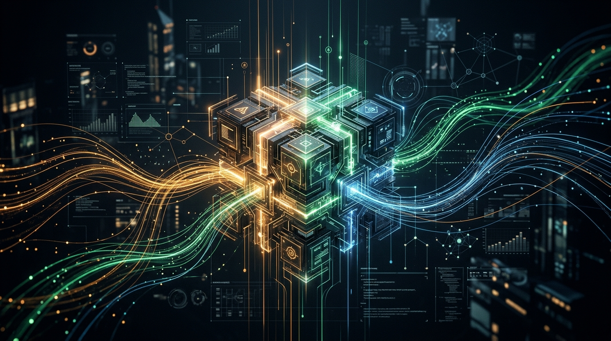
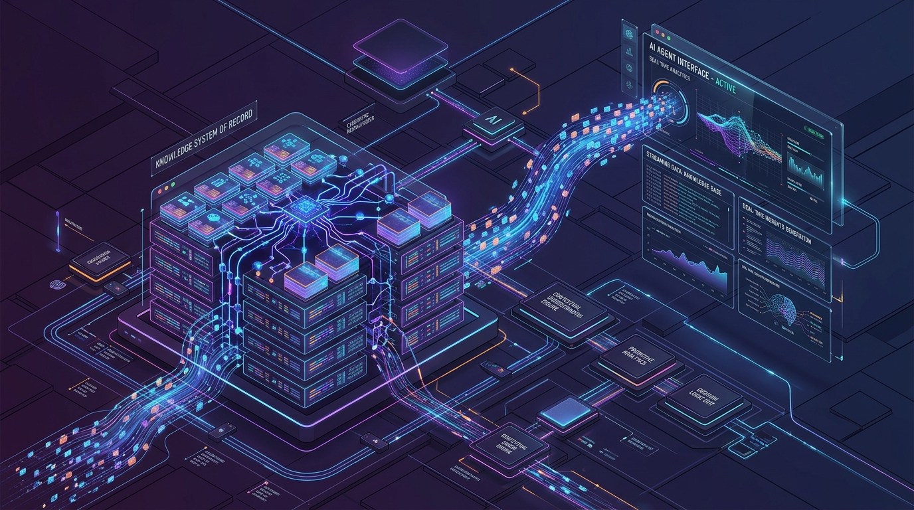

# ✦ BRIGHTLINE KSOR ✦
### **The Core Knowledge System of Record for AI Agents**

 

 
 

 

Brightline KSOR is a **state-of-the-art Knowledge System of Record (SoR)** engineered from the ground up to serve as the definitive, cryptographic source of truth for autonomous AI agents. 

Rather than a simple static documentation site, this architecture functions as a **living, governed data mesh**, feeding highly accurate, pre-embedded contextual knowledge into LLM systems via an advanced Model Context Protocol (MCP) stream.

---

 

*Isometric visualization of the KSOR Core Engine streaming real-time embeddings to consuming AI agents.*

 

## ⚙️ Core Architecture & Features

This system transcends traditional documentation by integrating a **Retrieval-Augmented Generation (RAG)** pipeline directly into the reading surface.

### ✦ Fully Governed Knowledge Base
Documents are rigorously governed through a cryptographic ledger. The system recognizes specific actors (defined in `.ksor/governance.yaml`) who have the authority to approve, publish, or take down knowledge. The record survives the system—meaning the raw Markdown corpus is preserved identically, regardless of the UI layer.

### ✦ MCP (Model Context Protocol) Streaming
Brightline KSOR acts as an **OAuth Resource Server**, providing a live stream of high-dimensional embeddings (via `pgvector`) directly to connecting AI agents. Agents query the MCP server, receive cryptographically signed citations, and retrieve precise chunks of knowledge. 

### ✦ Interactive AI RAG Interface
A deeply integrated, visually stunning RAG Chatbot is baked directly into the reading UI. Users can interrogate the database in natural language. The interface uses sophisticated framer-motion animations, real-time AI streams, and glassmorphic UI components to deliver an unparalleled premium experience.

### ✦ Ultra-Responsive Premium UI/UX
The front-end is meticulously crafted with absolute pixel perfection, dynamically shifting across complex flex grids, responsive `clamp()` typography, and absolutely positioned scalable SVG architecture graphs.
* **Fluid Dual-Theme System:** An intricate CSS-variable injected architecture powers a breathtaking Amber/Emerald Light Mode and a deep Obsidian/Purple Dark Mode.
* **Dynamic Header Pill:** The navigation bar breaks traditional layouts, manifesting as a floating glassmorphic pill with static gradient borders that responsively collapses and docks on mobile screens.

---

 

## 🛡️ Enterprise Security Posture

* **Strict Abstention Gating:** The vector retrieval engine is heavily calibrated. If a query falls outside the embedding floor digest (measured across `npx ksor calibrate`), the system issues an explicit "Not in this corpus" refusal rather than hallucinating an answer.
* **Stateless Edge Delivery:** Built to deploy to serverless containers, maintaining zero idle database connections and handling cold starts with robust retry mechanisms.

  

---

### ✦ ENGINEERED FOR THE FUTURE ✦

*"Transforming static text into living context for the autonomous web."*

 

**Designed & Developed by [Muhammad Shariq](https://www.linkedin.com/in/muhammad---shariq)**

